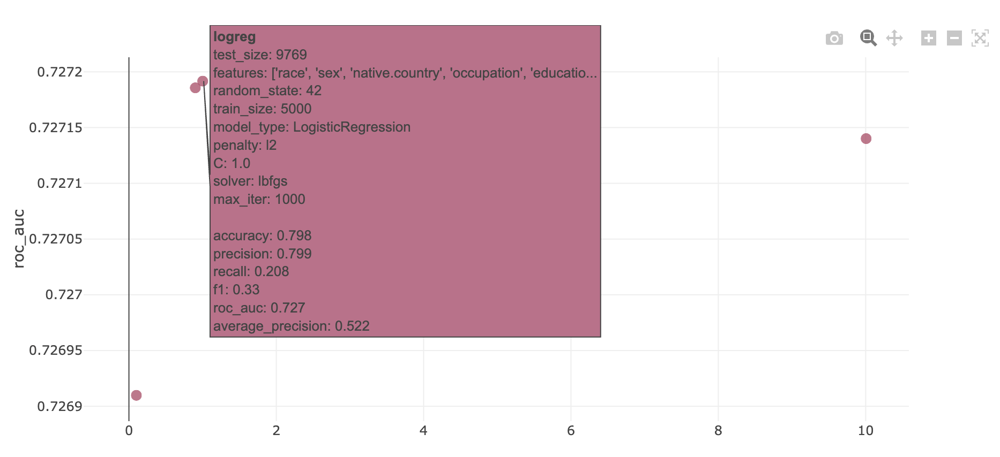
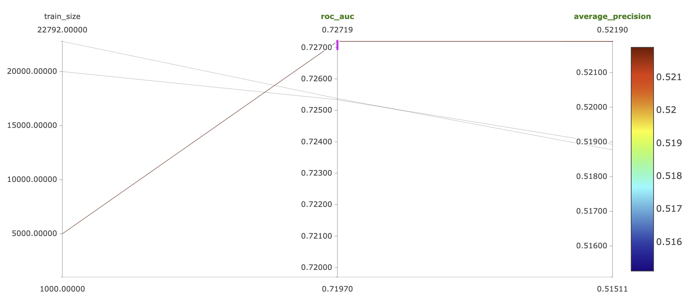
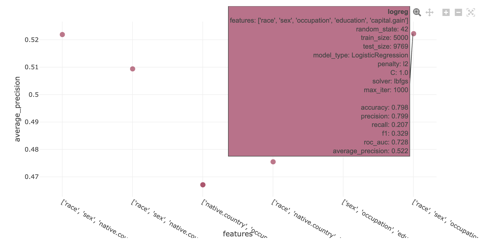
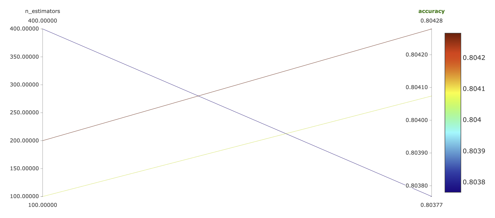
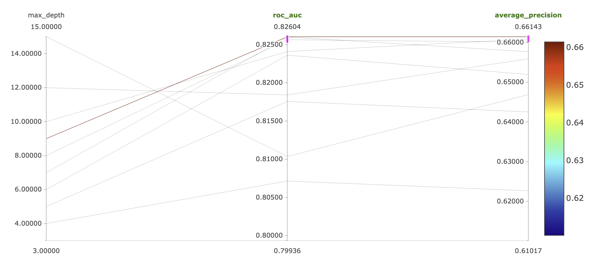
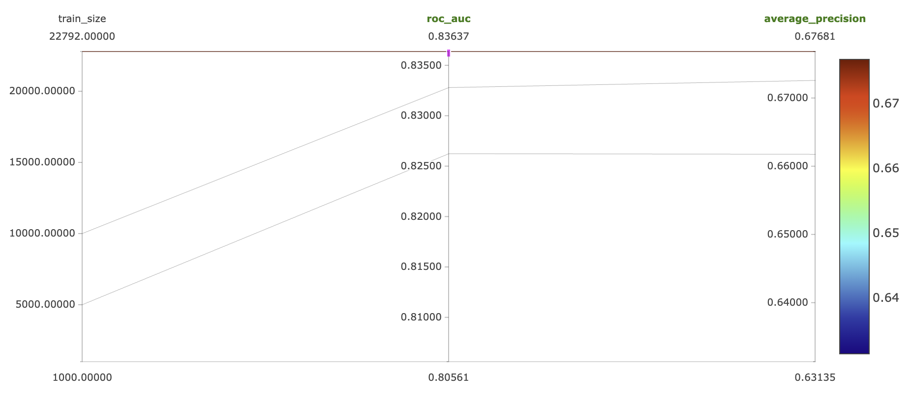
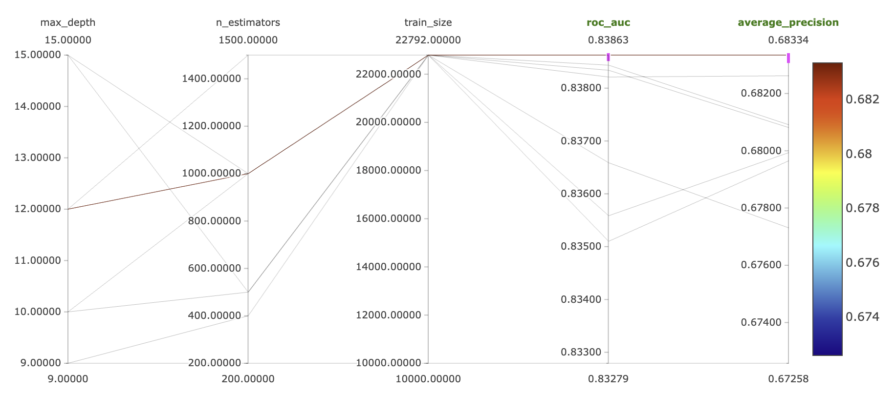

## логрег
1. Посмотрим, как влияет коэф l2 регуляризации на rocauc. Гипотеза: при увеличении коэфа $C$ метрика сначала будет расти, а потом падать. Сравним на 3 значениях)

Гипотеза подтвердилась, будем использовать C = 1.

2. Гипотеза: обучение логреги на большем наборе данных ведет к увеличению рокаука.

На удивление гипотеза не подтвердилась. Повторим ее еще на случайном лесе.

3. Урезание признаков приведет к уменьшению рокаука.

Также, на удивление, удаление признака native.country немного увеличило rocauc (но верятно, это не статзначимо).

## Рандом лес
1. Увеличения числа элементарных предикторов при остальных фиксированных признаках сначала увеличивает, а потом уменьшает метрики на валидации.

Будем использовать 200.

2. Увеличение глубины элементарных предикторов при остальных фиксированных признаках сначала увеличивает рокаук, а потом уменьшает.

Лучше всего себя показал эксперимент с depth=9.

3. обучение случайного леса на большем наборе данных ведет к увеличению рокаука

Тут все предсказуемо

## Лучшая модель

Параметры:
- $maxdepth = 12$
- $n\_estimators = 1000$
- $train\_size = \text{full}$
- $params = \text{all}$

Метрики:
- $roc\_auc \approx 0.839$
- $avg\_precision \approx 0.683$

Запуск:
- [best_run](http://158.160.2.37:5000/#/experiments/8/runs/9c42753d906f44b18c4905d8aa425741)
